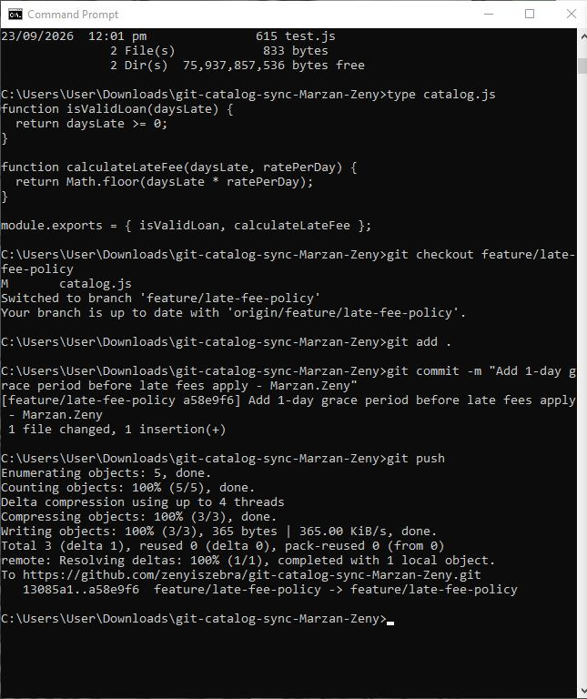
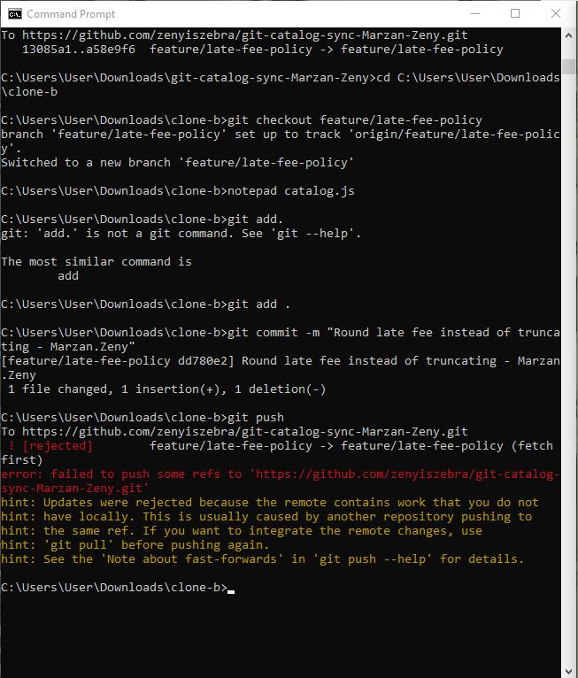
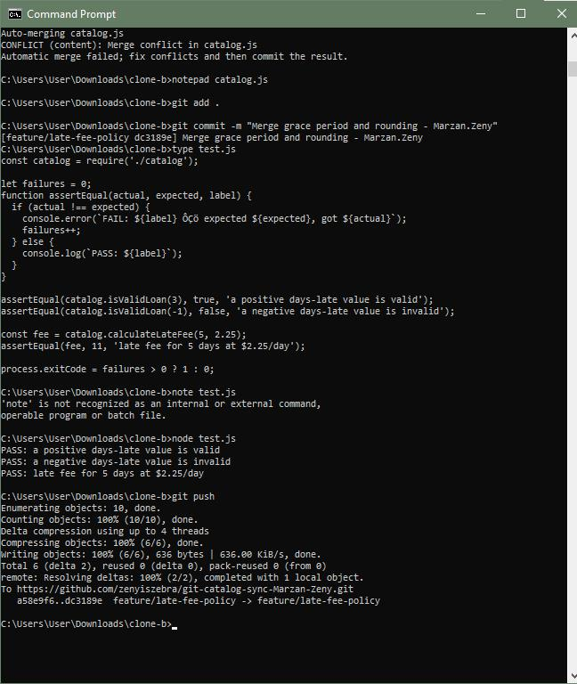
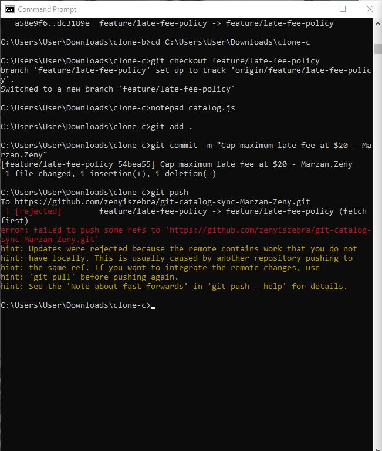
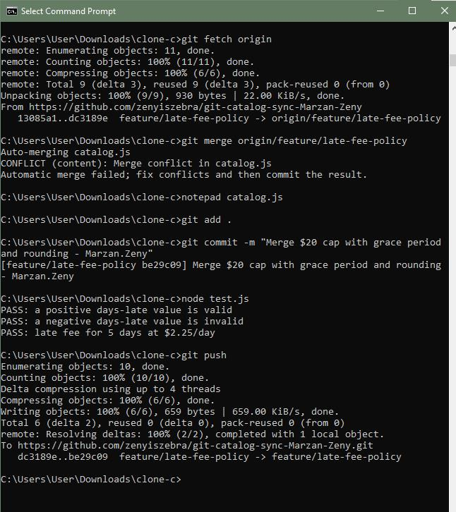
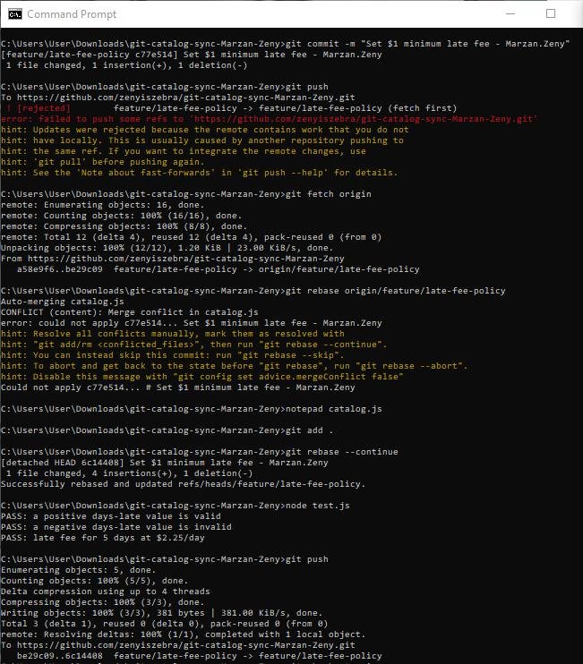
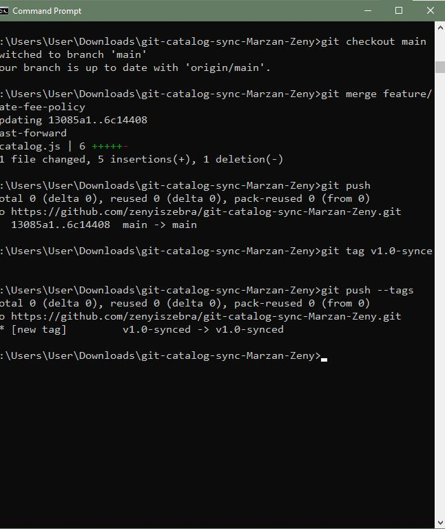

# WORKFLOW.md

## Screenshots









## Written Answers

### 1. Walk through the final calculateLateFee function

```js
function calculateLateFee(daysLate, ratePerDay) {
  if (daysLate <= 1) return 0;
  let fee = Math.round(daysLate * ratePerDay);
  fee = Math.min(fee, 20);
  fee = Math.max(fee, 1);
  return fee;
}
```

- `if (daysLate <= 1) return 0;` — added in Task 1 (Clone A), the 1-day grace period.
- `Math.round(daysLate * ratePerDay)` — added in Task 3 (Clone B), rounding the fee instead of truncating it with `Math.floor`.
- `fee = Math.min(fee, 20)` — added in Task 5 (Clone C), capping the fee at a $20 maximum.
- `fee = Math.max(fee, 1)` — added in Task 6 (Clone A's second change), setting a $1 minimum fee.

### 2. Task 3's two-way conflict vs Task 5's three-way conflict

In Task 3, I only had to reconcile two changes: the grace period and the rounding. It was mostly a matter of deciding to keep both lines. In Task 5, I had to merge a third, independent change (the $20 cap) into logic that was already a combination of two other changes. What got harder wasn't just adding one more line — it was making sure the *order* of operations was still correct. With three rules stacked (grace period, rounding, cap), the order they're applied in can change the final result, so I had to think through the sequence more carefully instead of just keeping every line from both sides.

### 3. Difference between Task 5 (merge) and Task 6 (rebase)

For Task 5, I used `git merge`, which combined the two branches' histories and created a new merge commit with two parents — the original commit history on both sides was preserved exactly as it happened, just tied together at the end. For Task 6, I used `git fetch` + `git rebase` instead, which replayed my commit on top of the already-merged history rather than creating a merge commit. This meant my `$1 minimum` commit ended up looking like it was made *after* everyone else's work, giving a straight, linear commit history instead of a branched one — that's also why the final push didn't need `--force`, since rebase moved my commit to sit cleanly on top of the current remote state.

### 4. Process change to prevent all three rejected pushes

If this were a real team of three, the simplest fix would be for everyone to `git pull` (fetch + merge/rebase) right before starting any new change, instead of working in isolation and only finding out about conflicts at push time. All three rejections happened because someone was editing based on a version of the branch that was already out of date by the time they tried to push.